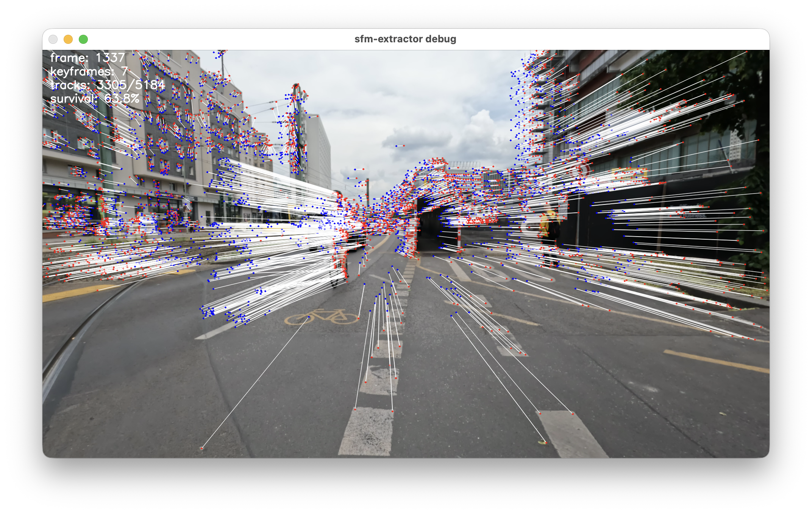

# Frame Extractor

Dynamically extract keyframes from video for SfM workflows to reduce processing time in COLMAP and similar reconstruction pipelines



## Install

```bash
pip install "git+https://github.com/<your-user>/<your-repo>.git"
```

For local development with `uv`:

```bash
uv sync
```

That creates `.venv/`, installs the dependencies, and installs the `frame-extractor` CLI for `uv run`.

## Run

After `pip install ...`, run:

```bash
frame-extractor input.mp4 --keyframe-directory out
```

From a local checkout with `uv`, run:

```bash
uv run frame-extractor input.mp4 --keyframe-directory out
```

Use one of the example presets from `configs/`:

```bash
uv run frame-extractor input.mp4 --config configs/default.yaml --keyframe-directory out
uv run frame-extractor input.mp4 --config configs/high.yaml --keyframe-directory out
uv run frame-extractor input.mp4 --config configs/low.yaml --keyframe-directory out
```

Useful options:

```text
frame-extractor input_video [options]
```

| Argument | Description | Default |
|---|---|---|
| `input_video` | Path to input video file | Required |
| `--config PATH` | Optional YAML config file | built-in defaults |
| `--keyframe-directory PATH` | Base output directory for timestamped keyframe folder, run metadata, and optional debug video | `None` |
| `--show-flow-vis` | Render optical-flow visualization and show the preview window | off |
| `--start-frame INT` | First frame index to process | `0` |
| `--max-frames INT` | Maximum number of frames to process | until end |

## Config

The `configs/` folder contains example presets. If you do not pass `--config`, the CLI uses built-in defaults that match [`configs/default.yaml`](configs/default.yaml).

The config surface is intentionally small:
- top-level keyframe-selection controls such as `min_survival_percent`, `motion_percentile`, `t_motion`, and `max_frames_since_keyframe`
- processing/output controls such as `n_downsample` and `keyframe_image_format`
- `gftt.*` settings for anchor-point detection
- `lk.*` settings for Lucas-Kanade tracking

[`configs/high.yaml`](configs/high.yaml) and [`configs/low.yaml`](configs/low.yaml) are override-only presets, so they contain just the values that differ from the default configuration.

## Output

If `--keyframe-directory out` is provided, the tool writes:
- `out/YYYYMMDD_HHMMSS/` for extracted keyframes
- `out/YYYYMMDD_HHMMSS.mp4` for the debug video when `--show-flow-vis` is enabled
- `out/YYYYMMDD_HHMMSS.yaml` for the effective config snapshot used for the run
- `out/YYYYMMDD_HHMMSS.txt` for the run summary

When `--show-flow-vis` is enabled, the preview and debug video include a bottom strip of recent extracted-frame thumbnails. The newest extracted frame appears on the left and older frames shift to the right.

Keyframes use this filename pattern:

```text
keyframe_<running_index>_<video_frame_index>.<ext>
```

## Repo Layout

The repo is intentionally flat:
- Python source files live in the repo root
- `configs/` contains example YAML presets
- `images/` contains README assets
