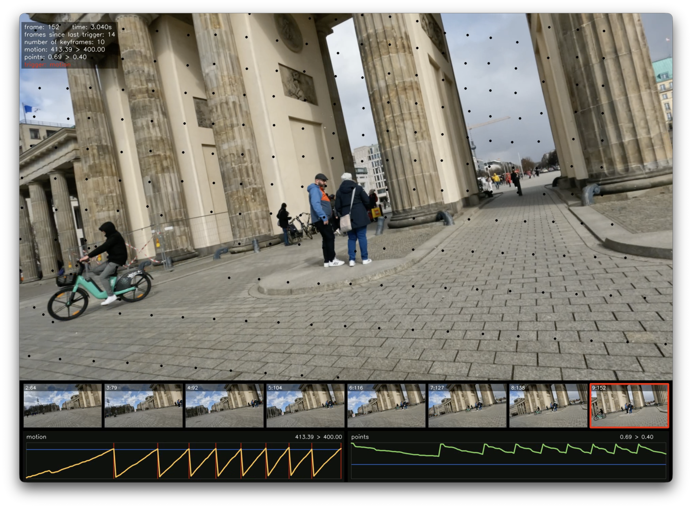

# Frame Extractor

Dynamically extract keyframes from video for SfM workflows to reduce processing time in COLMAP and similar reconstruction pipelines.

**This project has evolved into [Adaptive Frame Extractor](https://github.com/morishuz/adaptive-frame-extractor), a more mature cross-platform GUI app with additional features and no Python setup required. Future development is focused on the new app.**

The extractor uses dense OpenCV DIS optical flow to select SfM-friendly keyframes.

The extractor tracks a regular grid of points through adjacent-frame dense flow, scores cumulative displacement from the current keyframe, and triggers a new keyframe when motion or point loss crosses configured thresholds.



## Install

For local development with `uv`:

```bash
uv sync
```

That creates `.venv/`, installs dependencies, and makes the `frame-extractor` CLI available through `uv run`.

## Run

Basic run:

```bash
uv run frame-extractor input.mp4 --output-dir out/frame_extractor
```

Preview/debug run:

```bash
uv run frame-extractor input.mp4 --output-dir out/frame_extractor --show-preview
```

Throughput-only run with no files written:

```bash
uv run frame-extractor input.mp4
```

Limit the processed range:

```bash
uv run frame-extractor input.mp4 --config configs/default.yaml --start-frame 1000 --duration-frames 500
```

## CLI

```text
frame-extractor input_video [options]
```

| Argument | Description | Default |
|---|---|---|
| `input_video` | Path to input video file | Required |
| `--config PATH` | Optional YAML config file. Omit it to use the default settings. | default settings |
| `--output-dir PATH` | Optional base output directory for run files | no files written |
| `--show-preview` | Display the live debug preview. Also writes `debug.mp4` when `--output-dir` is set and `visualization.save_debug_video` is enabled. | off |
| `--start-frame INT` | First frame index to process | `0` |
| `--max-frames INT` | Maximum number of frames to process | until end |
| `--duration-frames INT` | Alias for `--max-frames`; use one or the other | until end |

## Config

The canonical config is [`configs/default.yaml`](configs/default.yaml). Pass it explicitly for reproducible runs, or omit `--config` to use the default settings. It includes:

- DIS optical-flow settings under `dis.*`
- Grid sampling settings under `sampling.*`
- Percentile motion scoring under `scoring.*`
- Keyframe trigger thresholds under `trigger.*`
- Preview/debug rendering settings under `visualization.*`
- Saved keyframe image format under `output.*`

## Output

If `--output-dir out/frame_extractor` is provided, each run creates a timestamped folder:

```text
out/frame_extractor/YYYYMMDD_HHMMSS[_NN]/
  config.yaml
  keyframes.csv
  summary.txt
  keyframes/
    keyframe_0000_000000.jpg
    keyframe_0001_001234.jpg
  debug.mp4        # only when --show-preview and visualization.save_debug_video are enabled
```

If `--output-dir` is omitted, the extractor does the keyframe computations and terminal progress reporting without writing files.

The first and last successfully processed frames are always selected. If a boundary frame also satisfies a normal trigger, it is written only once and its reasons are combined in `keyframes.csv`.

### Keyframe manifest

`keyframes.csv` contains one row per saved image. Its `filename` is relative to the run directory and matches the image under `keyframes/`.

| Column | Description |
|---|---|
| `filename` | Run-directory-relative image path |
| `processed_index` | Zero-based index within the requested processing range |
| `decoded_frame_index` | Zero-based source frame index used in the image filename |
| `pts` | OpenCV/FFmpeg presentation timestamp in the reported-FPS time base |
| `pos_seconds_raw` | Unmodified backend-reported `CAP_PROP_POS_MSEC / 1000` for the decoded frame |
| `timing_status` | `ok`, `warning`, or `invalid` for this decoded frame |
| `selection_reason` | Why the frame was saved: `first`, `final`, `motion`, `low_points`, `interval`, or a `+` combination |
| `motion_score_px` | Cumulative percentile motion score in original-video pixels |
| `in_bounds_ratio` | Fraction of sampled tracking points that remain alive and inside the image |

Run-level decoder and timing diagnostics, including the PTS time base, are
written to `summary.txt`.

## License

MIT. See [`LICENSE`](LICENSE).

## Repo Layout

```text
src/frame_extractor/
  __init__.py
  cli.py          # command-line argument parsing
  config.py       # typed config loading/validation
  output.py       # output paths, images, manifests, summaries, and debug video
  preview.py      # OpenCV preview/dashboard rendering
  runner.py       # main extraction loop
  status.py       # shared preview/terminal status formatting
  terminal.py     # live terminal status/progress
  timing.py       # video reads, frame timestamps/indices, and timing validation
  tracking.py     # DIS flow, point tracking, scoring, trigger logic
configs/
  default.yaml
images/
  screenshot_debug_view.png
tests/
  fixtures/       # tiny video and ffprobe oracle for timing regression
  test_cli.py
  test_config_tracking.py
  test_output_runner.py
  test_preview.py
  test_status.py
  test_tracking_math.py
  test_video_timing_regression.py
```
